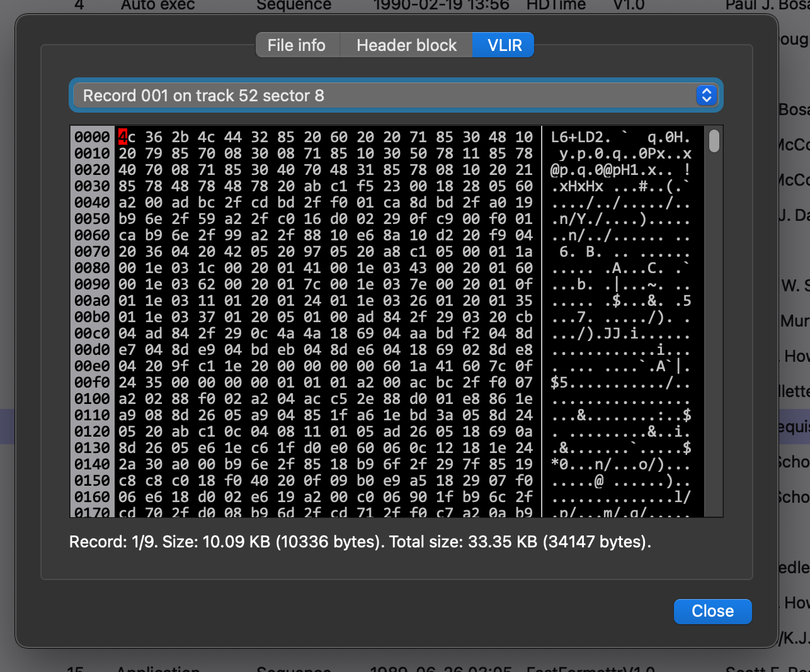

# c64diskutil

Commodore 64 disk image utility.

C++ Qt6 (Qt 6.2.4 LTS) project under development (2022-08-16).

The purpose of this utility is to make it possible to manage Commodore 64 disk images (.d64, .d71 and .d81), to collect technical information from the disk image and the files that are stored on it, to manage them. Geos disks and files are recognized and supported.

The project is developped on macOS Monterey (12.1), but should compile and run fine on other platforms, and versions (Window, Linux, ...).

## Features developed so far

- Load d64, d71 and d81 image formats
- Load and explore disk header, BAM (Block Availability Map) and directory
- List native Commodore 64 files and Geos files with their resources (icon, decription, size, date, ...)
- Graphical BAM explorer
- Hexadecimal viewer of various data (File Content, VLIR, disk header, Geos file header, directory entries, ...)

## Todo

- Handle more image formats
- Create new images
- Manage files (delete, copy, move, import, export, convert, ...)
- Manage application files (Basic programs, Geo Write documents, images, fonts, ...)
- Work closely with the Vice emulator
- Repair disks and files (validate)
- Handle CBM and DIR file types

## Screenshots

### File listing

### Disk info

d81 Geos disk image information dialog

d64 Native disk image information dialog

Graphical BAM explorer

### File info

File information dialog

### Hex viewer

