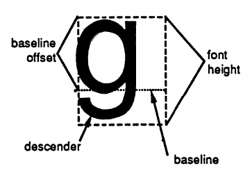

# Geos fonts
by [lyonlabs.org](https://www.lyonlabs.org/commodore/onrequest/geos/geos-fonts.html), last updated 2021-03-30



One of the signature features of GEOS for the Commodore 64 is that it uses proportional fonts. In this article, I'll describe how these fonts are laid out on disk. See the diagram (from the [Hitchhiker's Guide to GEOS](https://www.lyonlabs.org/commodore/onrequest/geos/geos-manuals/The_Hitchhikers_Guide_to_GEOS.pdf)) for common terms. The HHGG's section on "Text, Fonts, and Keyboard Input" is recommended reading. An excellent tool for editing and exploring fonts is Jim Collette's [Font Editor 2.5](https://www.lyonlabs.org/commodore/onrequest/geos/geos-font-collection-2a.d64).

I've written a [web app](https://www.lyonlabs.org/geofont/) (source code [here](https://gitlab.com/Cenbe/geofont-web)) to catalog and explore GEOS fonts, which are sortable by name or font ID. You can also select fonts to download; a disk image is generated on the fly. There's also a [PDF sample sheet](https://www.lyonlabs.org/commodore/onrequest/geos/geoFont.pdf) with a sorted list of font IDs and names. If you know of any fonts not listed there (or find something broken in the web app), please send an email to cenbe at protonmail dot com.

The research for this article was inspired by Dick Estel's [Font Resource Directory](https://www.lyonlabs.org/commodore/onrequest/geos/geoSpecific/DickE/DickE.html#pdfs) and articles. Thank you, Font Maniac!

Like many GEOS file types, fonts are stored as VLIR (variable-length indexed record) files. In a VLIR file, the directory entry, rather than pointing to the first track and sector of a chain (linked list) of sectors, points instead to a single sector containing an index of pointers to multiple chains ("records"). Generally speaking, each point size of a font is stored in one VLIR record, with the record number corresponding to the point size. So if a font had 10- and 12-point sizes, there would be two VLIR records: 10 and 12 (see the section on [mega fonts](https://www.lyonlabs.org/commodore/onrequest/geos/geos-fonts.html#mega) for an exception). There is also a system-resident font, BSW9.

***

## The file header

The directory entry of a GEOS file includes a pointer to the file header, a single sector containing the file's icon and some other information. Fonts use additional areas of the file header, located at the following offsets:

- **O_GHFONTID** ($80) one word
- **O_GHPTSIZES** ($82) 15 words
- **O_GHSETLEN** ($61) 15 words

(These are the labels used by the HHGG: the Programmer's Reference Guide uses different ones, and neither are included in geoProgrammer's geosSym table.)

**O_GHFONTID ($80)**: The font ID is a word (two bytes, low byte first) intended to be a unique identifier for the font. GEOS documents identify the combination of a font ID and a point size in *font escape* format, which is the font ID shifted left by six bits and ORd with the point size. This means that the actual font ID cannot be larger than $03ff. Unfortunately, the proliferation of GEOS fonts has still resulted in some duplicate font IDs. Here's an example of a font ID and its corresponding escape format. The University font's file header has the value $0001 at offset O_GHFONTID ($80). For the 12-point size, the font escape would be constructed like this:

```
f e d c b a 9 8 | 7 6 5 4 3 2 1 0
---------------------------------
0 0 0 0 0 0 0 0 | 0 0 0 0 0 0 0 1  <-- font ID (as in header)
0 0 0 0 0 0 0 0 | 0 1 0 0 0 0 0 0  <-- shift left six bits
0 0 0 0 0 0 0 0 | 0 1 0 0 1 1 0 0  <-- OR with $0c (12)
```

so the escape format for University 12-point is $004c. In geoWrite, a font escape consists of an escape character, the font ID and point size in escape format, and a style byte, so the complete sequence for University 12-point bold italic would be:

```
$17 NEWCARDSET escape
$4c font/point size (low byte first)
$00
$50 BOLDON ($40) | ITALICON ($10)
```

**O_GHPTSIZES ($82)**: The available point sizes can be found out in several ways. One, of course, is just to enumerate the VLIR record numbers. Another is to use the point sizes table in the file header, which contains a list of font/point size IDs in escape format. *Note that both this table and the following one (set length) are described incorrectly in BSW's Programmer's Reference Guide, the Hitchhiker's Guide to GEOS, and Alexander Boyce's GEOS Programmer's Reference Guide.* The lengths of the tables are 15, not 16. If it were 16, the point size table would overlap the file info block at $a0 (O_GHINFO_TXT), and the set length table would overlap the font ID at $80 (O_GHFONTID). The end of the table is padded with zeros.

**O_GHSETLEN ($61)**: This table also has an entry for each point size; the values are the size in bytes of the corresponding VLIR record when loaded into memory ("set length").

***

## The VLIR records

As noted above, each VLIR record of a font file corresponds to one point size. The data begin with a header and are followed by the bitstreams, one row at a time, for each character from $20 to $7f. The number of bitstreams is equal to the height of a character in pixels. (Imagine all the characters side by side; each bitstream is a row of pixels from first to last character, starting with the top row.)

| offset | bytes | font header data                                                                                      |
|:------:|:-----:|-------------------------------------------------------------------------------------------------------|
| 0      | 1     | Baseline offset (in pixels).                                                                          |
| 1      | 2     | Number of bytes in each bitstream row (set width).                                                    |
| 3      | 1     | Font height (number of bitstream rows).                                                               |
| 4      | 2     | Pointer to beginning of bitstream index table (usually $0008).                                        |
| 6      | 2     | Pointer to beginning of bitstreams (follows index table).                                             |
| 8      | ?     | Table of word-length entries listing the pixel offset for the start of each character in a bitstream. |
| ?      | ?     | Bitstream rows. Each row is padded with zero bits to make a full byte.                                |

***

## An Example

As an example, let's build up the lower-case 'g' in University 12-point. Here's the beginning of the first sector of VLIR record 12 (the first two bytes are the pointer to the next track/sector):

```
00: 19 01 08 48 00 0C 08 00
08: CA 00 00 00 04 00 06 00
10: 0A 00 12 00 18 00 20 00
18: 29 00 2B 00 2F 00 33 00
20: 3A 00 40 00 43 00 49 00
28: 4B 00 51 00 58 00 5B 00
30: 62 00 69 00 71 00 78 00
38: 7F 00 86 00 8D 00 94 00
40: 96 00 99 00 9E 00 A4 00
48: A9 00 B0 00 B9 00 C1 00
50: C8 00 CF 00 D6 00 DC 00
58: E2 00 E9 00 F0 00 F2 00
60: F9 00 00 01 06 01 0E 01
68: 15 01 1C 01 23 01 2A 01
70: 31 01 38 01 40 01 47 01
78: 4F 01 59 01 5F 01 65 01
80: 6B 01 6E 01 74 01 77 01
88: 7B 01 83 01 85 01 8B 01
90: 91 01 97 01 9D 01 A3 01
98: A8 01 AE 01 B4 01 B7 01
```

Consulting the hex dump, we see at offset 4 (skipping the first two bytes and counting from zero) that the index table begins at $0008 (low byte first). Character 'g' has the value $67; since the character range is $20 - $7f, we subtract $20 to get an index of $47. Each pixel offset is two bytes long, so $47 times two is $8e, plus $08 is $96 bytes from the beginning of the VLIR record. The word at offset $96 ($98 in the hex dump, because of the track/sector pointer) tells us that this character is $01a8 pixels (bits) from the start of each bitstream; dividing by eight gives us $35 bytes with no remainder. (Let's also make note of the pixel width of the character: the following character starts at $01ae, which makes it six pixels wide.) We find the start of the bitstream rows by looking at the value at offset $06, which is $ca, and offset 1 tells us that each bitstream row is $0048 bytes long. We also see at offset 3 that there are 12 bitstream rows (as we would expect from a 12-point font). So we need 12 character offsets into the bitstream data. The offsets we need, expressed as bytes from the beginning of the VLIR record, are:

```
$ca + $35 = $ff (start of bitstream data + character offset in bytes)
$ff + $48 = $147 (add the length of a bitstream to get the second line)
$147 + $48 = $18f
$18f + $48 = $1d7
$1d7 + $48 = $21f
$21f + $48 = $267
$267 + $48 = $2af
$2af + $48 = $2f7
$2f7 + $48 = $33f
$33f + $48 = $387
$387 + $48 = $3cf
$3cf + $48 = $417 (this is the offset to the twelfth line)
```

Walking through the sectors and taking into account the track and sector pointers, that gives us the following bytes (we can ignore the last two bits since the character is six pixels wide):

```
$02 - - - - - - X -
$02 - - - - - - X -
$7a - X X X X - X -
$8b X - - - X - X X
$8a X - - - X - X -
$8a X - - - X - X -
$8a X - - - X - X -
$8a X - - - X - X -
$7a - X X X X - X -
$08 - - - - X - - -
$88 X - - - X - - -
$70 - X X X - - - -
```

Can you see the 'g' on the left, and the leftmost part of the 'h' on the right? Note from the header that the baseline offset is $08; that corresponds to the $7a byte just above the descender. The GEOS PutString API takes the Y position of the baseline as a parameter; GetString uses the top of the character.

***

## Mega fonts

Because of GEOS' memory constraints, it's possible that an application will not have enough room to load a large point size. Early font designers worked out ad-hoc solutions where different parts of the character set were stored in different point sizes, but you'd have to either know in advance how the character set was laid out, or explore the font by trial and error. geoPublish standardized this with the introduction of "mega" fonts. The user selects the font, and geoPublish transparently loads the records it needs to render the text. As far as I know, it's the only application that can use mega fonts, although it's unlikely that you'd use something that large anywhere other than in desktop publishing. The user is still left with the problem of how to identify a mega font (the convention is for the file name to start with "MEGA"). Some font editors, like the one linked at the top of this page, can recognize mega fonts and create them from regular fonts.

Mega fonts are generally of about 48 points in actual size (check offset 3 in the font header), and have a fixed distribution of characters within the VLIR records:

```
48: $20-$2f (blank to '/')
49: $30-$3f ('0' to '?')
50: $40-$4f ('@' to 'O')
51: $50-$5f ('P' to '_')
52: $60-$6f ('`' to 'o')
53: $70-$7f ('p' to DEL)
```

There is also a 54-point record, which contains a complete bitstream index for every character (e.g. the indices for '0' to '?' are the same as those in record 49), but no bitstream data. The point sizes containing partial character sets contain proper bitstream indices for each character they contain, but an offset of one pixel for the characters that do not appear in that record. Naturally the use of these fonts is disk-intensive, although that's offset somewhat by the relatively small set width of each VLIR record (e.g. University 12-point has a set width of $48 for the entire character set; Mega Vatican has set widths of $2a, $2f, $3d, $3b, $30, $2c, and $2c).

As an example, here's the beginning of the first record (48) for the Mega Vatican font:

```
00: 1B 09 23 2A 00 30 08 00
08: CA 00 00 00 0E 00 17 00
10: 23 00 39 00 4E 00 68 00
18: 7E 00 85 00 91 00 9D 00
20: AF 00 C1 00 C8 00 D9 00
28: DF 00 F9 00 FA 00 FB 00
30: FC 00 FD 00 FE 00 FF 00
38: 00 01 01 01 02 01 03 01
40: 04 01 05 01 06 01 07 01
48: 08 01 09 01 0A 01 0B 01
```

Offset $04 in the font header (again, because of the track and sector pointer, that's offset $06 in the hex dump) shows that the bitstream index begins at $0008. Note that once we get beyond the range of characters contained in this record (at offset $2c in the hex dump), the character bitstream indexes start to increase by just one pixel.

Now let's have a look at the first sector of record 54:

```
00: 00 CB 23 2C 00 30 08 00
08: CA 00 00 00 0E 00 17 00
10: 23 00 39 00 4E 00 68 00
18: 7E 00 85 00 91 00 9D 00
20: AF 00 C1 00 C8 00 D9 00
28: DF 00 F9 00 0F 01 1D 01
30: 32 01 47 01 5D 01 72 01
38: 87 01 9D 01 B3 01 C8 01
40: CF 01 D6 01 E1 01 F2 01
48: FD 01 17 02 18 02 34 02
50: 50 02 6B 02 87 02 A2 02
58: BD 02 D9 02 F5 02 02 03
60: 17 03 32 03 4C 03 6C 03
68: 88 03 A4 03 BF 03 DB 03
70: F7 03 12 04 2D 04 4A 04
78: 67 04 8D 04 A7 04 C2 04
80: DD 04 E9 04 03 05 0F 05
88: 1E 05 1F 05 20 05 35 05
90: 4A 05 5F 05 75 05 8A 05
98: 9B 05 B0 05 C5 05 CC 05
A0: E1 05 F7 05 FF 05 1E 06
A8: 33 06 48 06 5D 06 73 06
B0: 85 06 9A 06 AB 06 C0 06
B8: D5 06 F4 06 0A 07 1F 07
C0: 34 07 40 07 41 07 4D 07
C8: 4E 07 A3 07 00 00 0F C0
```

Comparing this with the previous hex dump, we can see that there is a complete bitstream index here (note the differences starting at $2c), but there's no bitstream data. The track and sector pointer indicates that the last used byte in the sector is $cb, but the value at offset 6 tells us that the bitstream data start at $ca. Since the first two bytes of the sector are the forward pointer, that means that the bitstream would start at $cc in the hex dump, which is after the end of the data.